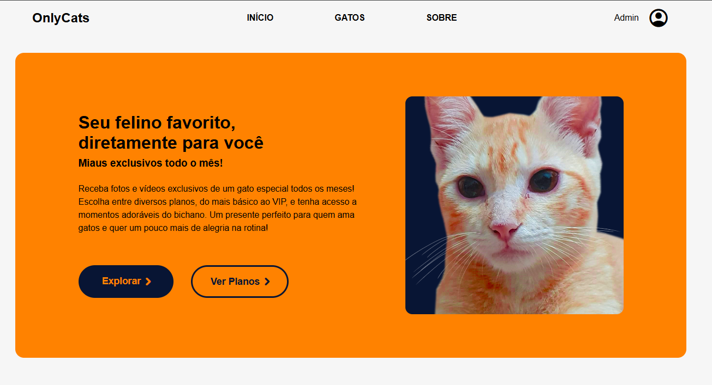

 Instituto Federal de Santa Catarina - Análise e Desenvolvimento de Sistemas - Programação Frontend I - 2024.2 

 

<h1 align="center"> Projeto 2 / Sistema de Assinatura Mensal: OnlyCats 😺 </h1>

 HTML/CSS/JS 
  

  

 

Professor: Adriano Lima  
Equipe: Júlia Manuela Turnes e Sofia Alves Toreti 
  

# 🐾 Nosso Projeto

OnlyCats é uma plataforma de assinatura mensal dedicada aos amantes de gatos! O site permite que os usuários recebam **fotos e vídeos exclusivos de gatinhos adoráveis** todos os meses, escolhendo entre diferentes planos — do mais simples ao VIP.

A ideia é trazer mais alegria para o dia a dia dos assinantes, com conteúdo carinhosamente selecionado de felinos especiais. Um presente digital perfeito para quem ama gatos!

 

  

 

# 💻 Tecnologias Utilizadas

- HTML5
- CSS3 
- JavaScript 

 

# 📃 Licença

Este projeto foi desenvolvido para fins educacionais como parte da disciplina de Programação Frontend I no IFSC. Não possui fins comerciais.
